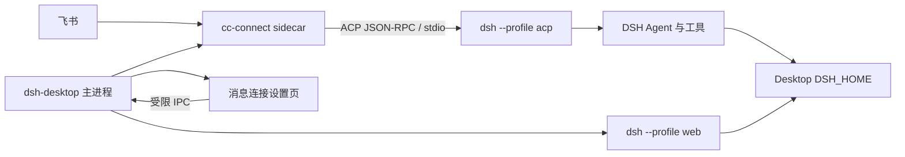

# cc-connect × DSH Desktop 集成执行计划

日期：2026-10-07

状态：待实现

父仓库分支：`codex/cc-connect-dsh-integration`

子模块目录：`third_party/cc-connect`

子模块开发分支：`codex/dsh-agent-integration`

## 1. 目标

在不复制 Harness 会话模型、不调用 Web 内部接口的前提下完成两层集成：

1. cc-connect 提供一级 `type = "dsh"` Agent，通过 DSH 官方 ACP stdio 协议驱动 `dsh --profile acp`。
2. dsh-desktop 随安装包携带 cc-connect，在设置页提供飞书连接配置，并由 Electron 主进程监管 cc-connect 的生命周期。

用户完成配置并启用后，应能从飞书发起 DSH 任务、看到流式文本和工具状态、处理权限请求、停止任务、列出并恢复持久会话。Web Harness 和 ACP Harness 使用同一个 Desktop `DSH_HOME`，但保持独立进程。

## 2. 已确认的代码事实

- cc-connect 已有通用 `agent/acp`，无需新增第二套 JSON-RPC transport。
- `agent/devin` 已提供“一级 Agent 薄封装通用 ACP”的可复制模式。
- 当前 cc-connect ACP 会话优先使用旧的 `session/load`；当前 DSH ACP 提供 `session/list`、`session/resume`、`session/close`，需要兼容补丁。
- DSH 的思考更新名为 `agent_thought_chunk`；当前映射表没有该名称。
- cc-connect 配置加载器会递归展开字符串中的 `${ENV_VAR}`。生成配置可以写 `app_secret = "${DSH_CC_CONNECT_FEISHU_SECRET}"`，明文只存在于 Electron 主进程和子进程环境。
- dsh-desktop 已有 `ManagedChild`、Harness 监管、窄 Preload IPC、`settings.section` 扩展位和完整资源哈希清单。
- 当前 `resources/harness` 内核包含 `@deepseek-ai/dsh-acp-app`，首次运行 `dsh --profile acp` 会初始化 Desktop Home 下的 `acp` profile。

执行前仍需重新读取实际代码；以上事实是计划基线，不允许用计划代替代码检查。

## 3. 目标进程结构



职责边界：

| 组件 | 负责 | 不负责 |
|---|---|---|
| DSH ACP | Agent、工具、模型、权限、会话持久化 | 飞书连接、桌面设置 |
| cc-connect | 飞书收发、平台会话映射、ACP 客户端 | Electron UI、Desktop 更新 |
| dsh-desktop | 二进制打包、配置、凭证、Sidecar 监管、状态 UI | 复制 Agent 循环或会话数据库 |

## 4. 仓库与分支规则

父仓库记录子模块固定提交，`.gitmodules` 的远端为：

```text
git@github.com:citrusli2026/cc-connect.git
```

开发顺序必须是：

1. 在 `third_party/cc-connect` 的 `codex/dsh-agent-integration` 分支实现并提交。
2. 运行子模块测试，推送子模块分支。
3. 回到父仓库，提交更新后的 submodule gitlink。
4. 实现 Desktop 侧并提交父仓库。

禁止在父仓库中复制 cc-connect 源码。禁止把子模块未提交的工作树当作父仓库提交的一部分。

常用检查：

```bash
git status --short --branch
git submodule status
git -C third_party/cc-connect status --short --branch
git diff --submodule=log
```

## 5. cc-connect 目标设计

### 5.1 一级 DSH Agent

新增 `agent/dsh`，结构参照 `agent/devin`：

```go
type Agent struct { *acp.Agent }
func (a *Agent) Name() string { return "dsh" }
```

默认值：

| 字段 | 默认值 |
|---|---|
| `command` | `dsh` |
| `args` | `["--profile", "acp"]` |
| `display_name` | `DeepSeek Harness` |

用户显式提供的 `command`、`args`、`display_name`、`work_dir`、`env` 必须保留。Desktop 会覆盖为捆绑 Node 与 DSH JS 入口的绝对路径。

### 5.2 ACP 兼容矩阵

MVP 必须支持：

| 能力 | DSH 方法/事件 | cc-connect 行为 |
|---|---|---|
| 新会话 | `session/new` | 保留现有实现 |
| 列表 | `session/list` | 解析 `list` capability；保留 cwd 二次过滤 |
| 恢复 | `session/resume` | capability 存在时使用；响应可不含 sessionId |
| 旧服务恢复 | `session/load` | 保持兼容，优先级高于 resume 或按服务声明选择 |
| 关闭 | `session/close` | 最多等待 2 秒，随后按原流程终止子进程 |
| 取消 | `session/cancel` | 保留现有实现 |
| 回答 | `agent_message_chunk` | 保留现有映射 |
| 思考 | `agent_thought_chunk` | 映射为 `core.EventThinking` |
| 工具 | `tool_call` / `tool_call_update` | 保留现有映射 |
| 权限 | `session/request_permission` | 保留现有 allow/reject 映射 |

MVP 不实现 ACP `configOptions` 到 `/model` 的交互式映射。模型与推理强度先由 DSH `acp` profile 决定。该能力列入后续阶段，避免为首版修改 cc-connect `core` 命令接口。

### 5.3 Desktop 生成的 cc-connect 配置

配置文件位于 Electron `userData/cc-connect/config.toml`，只含非敏感设置和 Secret 占位符：

```toml
data_dir = "/absolute/userData/cc-connect/data"
language = "zh"

[log]
level = "info"

[[projects]]
name = "dsh-desktop"

[projects.agent]
type = "dsh"

[projects.agent.options]
command = "/absolute/resources/harness/node/bin/node"
args = [
  "/absolute/resources/harness/node_modules/@deepseek-ai/dsh/lib/bin.js",
  "--profile",
  "acp"
]
work_dir = "/absolute/user/workspace"

[projects.agent.options.env]
DSH_HOME = "/absolute/home/.dsh-desktop"

[[projects.platforms]]
type = "feishu"

[projects.platforms.options]
app_id = "cli_xxx"
app_secret = "${DSH_CC_CONNECT_FEISHU_SECRET}"
allow_from = "*"
```

不要启用 cc-connect 的 bridge、management 或 webhook 监听。首版只使用飞书长连接。

## 6. Desktop 目标设计

### 6.1 打包

增加 `scripts/build-cc-connect.mjs`：

- 在 `third_party/cc-connect` 执行本机目标的 Go build。
- 输出到 `resources/cc-connect/bin/cc-connect`，Windows 使用 `.exe`。
- 使用 `-trimpath`，将 submodule commit 写入 ldflags；不调用 cc-connect 自更新。
- 生成 `resources/cc-connect/manifest.json`，记录 commit、目标平台、架构、SHA-256。
- `electron-builder.yml` 将 `resources/cc-connect` 放到应用 `resources/cc-connect`。
- 现有 closure seal 会覆盖该目录；同时补充 packaged-resource 测试和 Windows installer 检查。

普通 `pnpm run build` 不强制本机安装 Go。新增独立 `pnpm run cc-connect:build`，`dist`、`dist:dir` 和发布 CI 在打包前显式执行它。

### 6.2 配置与凭证

新增建议文件：

```text
src/main/cc-connect-config.ts
src/main/cc-connect-credentials.ts
src/main/cc-connect-supervisor.ts
```

规则：

- 非敏感设置写入 `userData/cc-connect/settings.json`。
- TOML 通过结构化值生成并原子写入，权限为 `0600`；不要拼接未转义用户输入。
- 飞书 Secret 使用 Electron `safeStorage.encryptString()` 保存。
- `safeStorage` 不可用时允许使用权限为 `0600` 的本地 fallback，并在状态中返回 `credentialProtection: "file"`；不得把明文放入 TOML。
- Renderer 只得到 `secretConfigured: boolean`，永远没有读取 Secret 的 IPC。
- 启动 cc-connect 时设置 `DSH_CC_CONNECT_FEISHU_SECRET`，并将 `DSH_HOME` 指向 `desktopDshHome()`。

### 6.3 Sidecar 生命周期

状态机：

```text
disabled -> stopped -> starting -> ready
                         |          |
                         v          v
                       crashed <- degraded
```

- 用户设置 `enabled=true` 且配置完整后才启动。
- 等 Web Harness 首次 ready 后启动 Sidecar。
- 解析 cc-connect 稳定的 `cc-connect ready` 日志作为 readiness；该日志由子模块任务新增。
- 异常退出采用与 Harness 相同风格的有限退避：5 分钟内最多 5 次。
- App 退出：SIGTERM，5 秒后 SIGKILL；纳入现有 8 秒总退出保护。
- 进入 Safe Mode：停止 Sidecar并保持 `enabled`；退出 Safe Mode：若配置仍完整则恢复。
- Kernel install/restore 成功后重写 DSH bin 路径并重启 Sidecar。
- 日志写 `userData/logs/cc-connect.log`；写入前对 App Secret、环境值和 token 进行替换。

### 6.4 IPC 与设置页

Preload 只暴露：

```ts
getConnectState(): Promise<ConnectState | null>
saveConnectSettings(input: ConnectSettingsInput): Promise<ConnectSaveResult | null>
pickConnectWorkspace(): Promise<string | null>
startConnect(): Promise<boolean>
stopConnect(): Promise<boolean>
restartConnect(): Promise<boolean>
```

`ConnectState` 最多包含：enabled、phase、appId、secretConfigured、workspace、credentialProtection、lastError、restartAttempts。`lastError` 必须脱敏并限长。

在 `dsh-desktop-controls` 新增一个 `settings.section`，建议 id 为 `dsh-desktop-connect`、order 为 `22`。首版字段与操作：

- 启用开关
- 飞书 App ID
- 飞书 App Secret（空值表示保留）
- 默认工作目录和选择按钮
- 保存、启动/停止、重连
- 当前状态和最近错误

提供中文和英文文案。不向 overlay、tray 或 Extensions 菜单增加入口，以免破坏 ADR 0023 的三项一致性。

## 7. 范围限制

首版包含：飞书长连接、单项目、单默认工作区、文本、现有附件降级、工具进度、权限、停止、列表和恢复。

首版不包含：

- Telegram、Slack 等其他平台的 Desktop 表单
- cc-connect Web 管理台
- ACP 模型/推理强度选择 UI
- 一个 ACP 进程复用多个 cc-connect 会话
- ACP 原生图片块
- 把运行中的 ACP 会话实时嵌入 Web 对话页
- 自动导入和停止用户现有的全局 cc-connect daemon

这些限制应写入发布说明，不能用静默降级伪装成已支持。

## 8. 完成定义

只有同时满足以下条件才算完成：

1. 子模块 `type = "dsh"` 单元测试和 ACP DSH 兼容测试通过。
2. 子模块全量 `go test ./...` 通过。
3. 父仓库 typecheck、unit、runtime boundary 和 build 通过。
4. 打包目录包含可执行 cc-connect 和 manifest，closure manifest 含其哈希。
5. Electron E2E 能在假 Sidecar 下覆盖保存、启动、ready、崩溃、停止和 Safe Mode。
6. 手工飞书验证完成一次新会话、一次停止、一次会话恢复和一次权限选择。
7. 仓库扫描不到真实 App ID、App Secret、token、用户绝对凭证路径。
8. `progress.md` 记录每项的提交、命令、退出码、未覆盖项和下一任务。

## 9. 给执行模型的工作规则

1. 先读本文件、`tasks.md`、`validation.md`、`progress.md`，再读父仓库和子模块各自的 `AGENTS.md`。
2. 一次只完成一个任务；不要同时改 cc-connect 和 Desktop。
3. 每项先写能失败的测试或检查，再写最少实现。
4. 子模块改动先在子模块提交；父仓库只记录已提交的 gitlink。
5. 不升级 DSH、Electron、Go 依赖或 cc-connect 依赖，除非任务明确要求。
6. 不修改用户真实的 `~/.cc-connect/config.toml`、`~/.dsh`、`~/.dsh-desktop`。
7. 测试必须使用临时目录、假 Secret 和假 Sidecar。
8. 不执行真实发布，不改稳定更新源，不上传安装包。
9. 不使用 `git add -A`；按任务列出的文件精确暂存。
10. 遇到失败先记录事实和最小复现，不用跳过测试完成任务。

## 10. 可直接交给执行模型的启动消息

> 在 `/Users/citrus/dsh-desktop` 的 `codex/cc-connect-dsh-integration` 分支工作。先读父仓库 `AGENTS.md`、`docs/plans/cc-connect-dsh-integration/README.md`、`tasks.md`、`validation.md` 和 `progress.md`，再读 `third_party/cc-connect/AGENTS.md`。按 `progress.md` 的下一项执行，一次只完成一个任务。子模块改动必须先在 `third_party/cc-connect` 的 `codex/dsh-agent-integration` 分支提交，再更新父仓库 gitlink。不要接触真实飞书凭证或用户配置，不升级无关依赖。每项完成后更新 progress，写明提交 SHA、测试命令、退出码、未覆盖项和下一任务。
